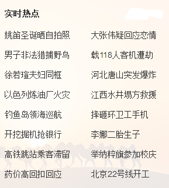
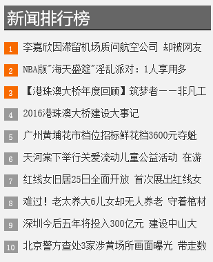
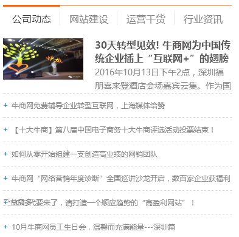

#文章列表标签使用说明
##使用样例

```
<ul>
    <nsw:article var="A" size="3" type="top">
        <li><a href="${A.url}">${A.title}</a></li>
    </nsw:article>
</ul>
```

##生成效果

```
<ul>
    <li><a href="articles/QXYX73.html">清爽一夏_副本_6</a></li>
    <li><a href="articles/QXYX80.html">清爽一夏_副本_6</a></li>
    <li><a href="articles/QXYX84.html">清爽一夏_副本_6</a></li>
</ul>
```

\* _默认是从当前项目中取文章_
\* _列表顺序为最近更新时间倒序，即越近更新的，排在越前面

##变量说明
|变量名|是否必须 |默认值| 说明|
----------|---------|--------|----------|
var|否|A|引用变量名称
stat    |否  |stat   |循环索引变量
channel|否| | 频道名称，为空则不限制频道
ctg|否| | 分类名称，为空则不限制分类
type|否| | 文章类型，有3种类型，分别是recommend(推荐 ),top(置顶),essence(精华) ，为空则不限制
size|否|10|需要取的文章总条数,默认为10条
start|否|1|循环起始条数,从1开始
end|否| | 循环结束，比如可能取了100条数据，只需要到80就可以了，那么这里写80
step|否| |步长，默认为1，在一个循环中，比如我要1,3,5,7,9这样的跳着数，那么此处就是2
   
###循环变量 stat的使用
stat变量包含：

| 变量名称|说明|
|------------|------|
index        |当前循环数，从0开始
count        | 当前循环数 从1开始
size          |总大小
odd          | 是否是偶数行
even        |  是否是奇数行   
first           | 是否是第一行
last           |  是不是最后一行

##我可以使用文章的哪些信息

    {
        "_id": "5858d5c6d631a195e45dd716",
        "desc": "11234654654",
        "clicks": 1,
        "isLink": false,
        "publishTime": "2016-12-20 14:55",
        "title": "清爽一夏_副本_10",
        "projId": "27521_PC",
        "shortTitle": "",
        "linkUrl": "",
        "author": "asdf",
        "authorLink": "",
        "editor": "asdf",
        "editorLink": "",
        "src": "sdaf",
        "srcLink": "",
        "isRecommend": true,
        "isDisplayTop": true,
        "isEssence": false,
        "displayTime": "",
        "lastUpdTime": "2016-12-23 15:29:27",
        "createdTime": "2016-12-20 14:55:02",
        "site": "27521",
        "url": "articles/QXYX80.html",
        "imgSm": {
            "url": "27521_PC/resource/images/9744b61e7f494b39b16417594bede65a_8.jpg"
        },
        "channelName": "资讯频道",
        "ctgName": "test二级分类",
        "tagNames": "客厅 实木家具 实木家具怎么样 实木家具定制 dfgdf"
    }

 做了这些处理
+ 可通过 ${A.channelName} 引用 频道名称
+ 可通过 ${A.ctgName} 引用 分类名称
+ 可通过 ${A.tagNames} 引用 标签名称组合

##可以用在哪些地方?



###我们以新浪的一个tab为例


说明一下大概的思路和写法
+ 总个有10个新闻
+ 前3个文章有图片
+ 然后有5个是li列表中(倒数第二行其实有3个文章,这里我们简单的当作每行一个)
+ 最后一个li中有两个文章

以下是大概的写法

```
<div tab-type="tab-cont">
    <div>
        <div blktitle="热点" >
            <div data-sudaclick="blk_hot_pic"><!-- 前3个展示图片 -->
                <nsw:article channel="体育频道"  ctg="热点文章" type="top" size="10" end="3" var="A">
                    <a class="uni-blk-pic" target="_blank" href="${A.url}"></a>
                </nsw:article>
            </div><!-- 然后是6个li列表 -->
            <ul class="uni-blk-list02 list-a" style="padding-top:7px; _zoom:1;" >
                <nsw:article  channel="体育频道"  ctg="热点文章"  type="top" size="10" start="4" end="8" var="A">
                    <li><a target="_blank" href="${A.url}">${A.shortTitle}</a></li>
                </nsw:article>
                <li><!--最后一个li里面有2个a -->
                <nsw:article  channel="体育频道"  ctg="热点文章" type="top" size="10"  start="9" end="10" var="A">
                    <a target="_blank" href="${A.url}">${A.shortTitle}</a>
                </nsw:article>
                </li>
            </ul>
        </div>
    </div>
</div>
```

因为系统在同一个页面生成时，相同条件下会做缓存，所以读取速度会快一些，也尽量建议在遇到类似情况时，采用这种方法，比如上面的缓存条件是：
>channel="体育频道"  ctg="专栏文章" type="top" size="11"

###再看看牛商网首页的列表引用


思路比较简单，
+ 第一个有图片，可能为置顶的，
+ 其他的是简单的列表，总共有6条

写法如下：

```
<div class="con" style="display: block;">
    <dl>
        <nsw:article channel="公司动态" type="top" size="1" ><!-- 取置顶的1条 -->
        <dt><a href="${A.url}" target="_blank" title="${A.title}" looyu_bound="1"></a></dt>
        <dd>
            <b><a href="${A.url}" target="_blank" title="${A.title}" looyu_bound="1"></a></b><p><a href="${A.url}" looyu_bound="1">[详情]</a></p>
        </dd>
        </nsw:article>
    </dl>
    <ul class="ul2">
        <nsw:article channel="公司动态" size="6" ><!--  取最近更新的6条 -->
        <li><a href="${A.url}" title="${A.title}" target="_blank" looyu_bound="1">${A.title}</a></li>
        </nsw:article>
    </ul>
</div>
```

