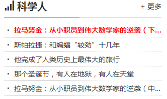
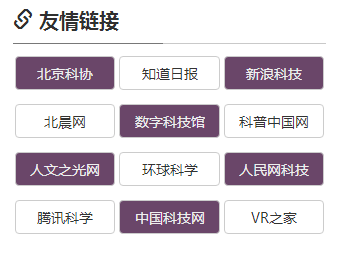

#循环标签中的样式使用说明
## 什么是循环类标签?
循环类标签是用于提取一组数据，然后循环处理标签体内的一类标签，比如

+  nsw:article 文章列表
+  nsw:product 产品列表
+  nsw:relarticle 相关文章
+  nsw:relproduct 相关产品
+  nsw:frl 友情链接
以及类似的标签

在一个列表中，我们常常会用到一些行样式，如第一行标红，奇数行偶数行不同颜色等，
通常情况下，用CSS的选择器处理会方便很多，但是我们在这里也针对这种情况提供了一种class 标签
他们是

+  1class  附加在第一行的样式，1到5类推
+  2class    
+  3class    
+  4class
+  5class
+  lastclass   附加在最行一行的样式
+  oddclass  附加在偶数行的样式
+  even class   附加在奇数行的样式
+ interclass   间隔行数附加 形式为 `数字,样式` 的方式进行组合，数字为间隔数，如2，则每隔2个，3，则每隔3个
 
##举个列子

为了醒目，第一行加粗标红了

    <ul class="main-lists border-row dot black cuttitle">
        <nsw:article channel="科学人" size="5" type="recommend">
            <li 1class="rec"><a href="${A.url}" title="${A.title}" target="_blank">${A.title}</a></li>
        </nsw:article>
    </ul>

##另一个例子

这是一个友情链接的例子，所有奇数行都被标了一种even样式

    

        

            <nsw:frl var="f">
                <a evenclass="even" class="btn btn-default" href="${f.url}" target="_blank">${f.name}</a>
            </nsw:frl>
        

    

上面只是两个简单的样例，这些标签是循环共有的，他们可以用在不同的场合，不同的组合，形成不同的效果。

*注意： 这些样式不会清除原有的样式，会以追加的形式加到原来的class 属性后面 ，如上面的例子形成的效果是*

    

        

            <a  class="btn btn-default even" href="#" target="_blank">北京科协</a>
            <a  class="btn btn-default" href="#" target="_blank">知道日报</a>
            <a  class="btn btn-default even" href="#" target="_blank">新浪科技</a>
        

    

