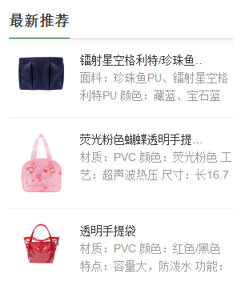
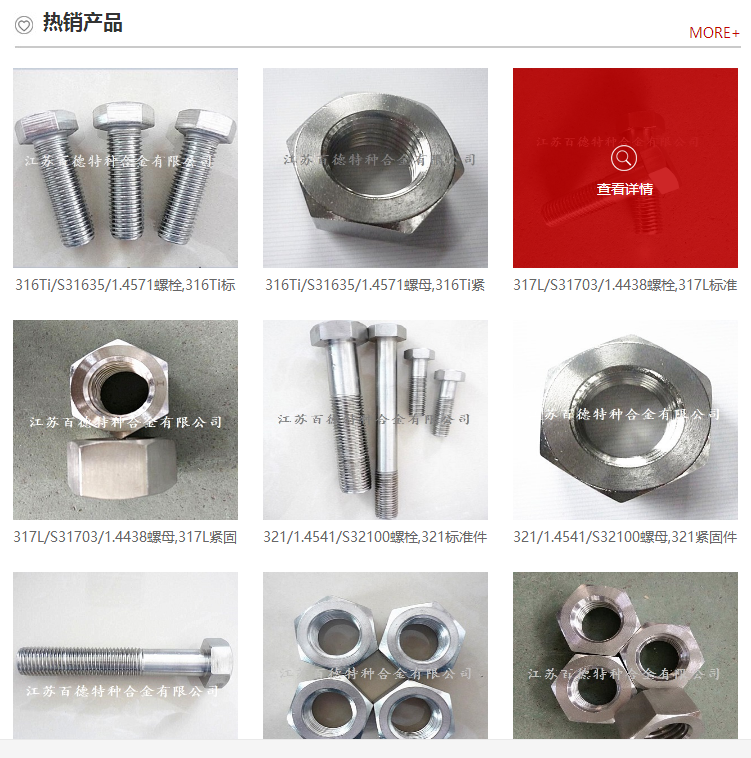

#产品列表标签
##使用样例

    <nsw:product var="p" type="top">
        <li><a href="${p.url}">${p.title}</a></li>
    </nsw:product>

##生成效果

    <ul>
        <li><a href="products/BBYBB89.html">BBYBB_副本_1</a></li>
        <li><a href="products/DaLeiDa.html">大磊大</a></li>
    </ul>

##变量说明
|变量名|是否必须 |默认值| 说明|
----------|---------|--------|----------|
var        | 否        |P       |引用变量名称
stat       |否         |stat    |循环索引变量
channel   |否        |           |频道名称，指定频道的产品
ctg       |否         |           |分类名称,指定分类下的产品
type     | 否        |           |类型，recommend:推荐 ,top:置顶 ，默认为全部，并案更新时间倒序
size     |否         |10       |需要取的文章总条数,默认为10条
start    |否         |1          |循环起始条数,从1开始
end     |否         |            | 循环结束，比如可能取了100条数据，只需要到80就可以了，那么这里写80
step    |否         |            |步长，默认为1，在一个循环中，比如我要1,3,5,7,9这样的跳着数，那么此处就是2     

###循环变量的使用
stat变量包含：

| 变量名称|说明|
|------------|------|
index        |当前循环数，从0开始
count        | 当前循环数 从1开始
size          |总大小
odd          | 是否是偶数行
even        |  是否是奇数行   
first           | 是否是第一行
last           |  是不是最后一行

##可以使用产品的哪些信息

    {
        "_id": "585e0c2dd63197c283381e53", 
        "clicks": 1, 
        "isLink": false, 
        "publishTime": "2016-12-24 13:47", 
        "seo": {
            "staticPageName": "DaLeiDa", 
            "title": "棋", 
            "keyword": "柘城", 
            "desc": "硒鼓", 
            "innerLink": {
                "enable": true
            }
        }, 
        "isDisplay": true, 
        "title": "大磊大", 
        "isEnableThirdPartyMall": false, 
        "isRecommend": true, 
        "moduleId": "57157f0f82ce598105101a24", 
        "projId": "27521_PC", 
        "shortTitle": "", 
        "linkUrl": "", 
        "thirdPartyMallUrl": "", 
        "isDisplayTop": true, 
        "isDisplayInMainPage": false, 
        "displayTime": "", 
        "tags": [
            {
                "_id": "5841289782ce2b6011cc8a32", 
                "site": "27521", 
                "lastUpdTime": "2016-12-02 15:53:59", 
                "ctgId": "57157f0f82ce598105101a25", 
                "createdTime": "2016-12-02 15:53:59", 
                "projId": "27521_PC", 
                "name": "实木家具定制"
            }
        ], 
        "lastUpdTime": "2016-12-26 16:04:04", 
        "createdTime": "2016-12-24 13:48:27", 
        "site": "27521", 
        "imgs": [
            {
                "url": "27521_PC/Skins/Default/Img/Index/pro_pic01.jpg", 
                "urlSm": "27521_PC/Skins/Default/Img/Index/pro_pic01_sm.jpg", 
                "alt": null
            }
        ],
        "desc": "
①有过建材行业的品牌运作......
", 
        "channelName": "产品频道", 
        "ctgName": "卧室家具", 
        "tagNames": "实木家具定制 深圳定制家具", 
        "url": "products/DaLeiDa.html"
    }

*tips:* imgs中的 urlSm 是产品的缩略图，大小为60*60这样子，url为产品样张图

##案例一

思路：产品基本信息+一张缩略图
大致写法如下：

    

    <nsw:product size="5" type="recommend">
          <dl> 
           <dt> 
             
           </dt> 
           <dd> 
            <a href="${P.url}" title="${P.title}">${P.title}</a> 
            
${P.desc}
 
           </dd> 
          </dl> 
      </nsw:product>
    

##案例二

其写法大致如下

    <ul class="u_lst1">
    <nsw:product size="9" type="top">
          <li interclass="3,lastli">  <a href="${P.url}" title="${P.title}">查看详情</a> <em><a href="${P.url}" title="${P.title}">${P.title}</a></em> </li>
          </nsw:product>
    </ul>

此时，我们发现一个问题

他的每第三个li元素是有一个 `lastli` 属性用来换行，我们提供的nth class中，对1-5，first,last,odd,even这样的元素有提供class附加，对于这种情况，建议采用css选择器来实现,这种情况也大部分可以采用CSS选择来实现，如上面的可以写成

    .g_pro .u_lst1 li:nth-child(3n) {
            margin-right: 0;
    }

有关nth-child的更多信息，请参考 [CSS3 :nth-child() 选择器](http://www.w3school.com.cn/cssref/selector_nth-child.asp) 

**如果实在要用**
比如要兼容老的浏览器，那么系统提供了 interclass属性，表示间隔的class,其组合方式为   `数字,样式 ` 数字表式间隔几个，样式是匹配后要附加的样式，就像上面的例子中的li上面写的那样

	<li interclass="3,lastli"> <a href="${P.url}" title="${P.title}"> .... </li>
