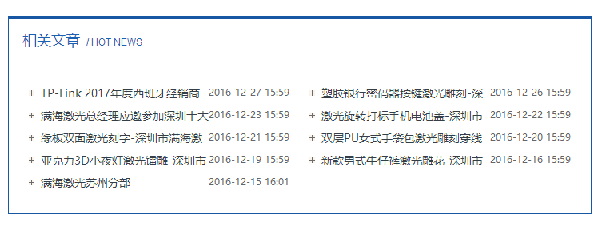
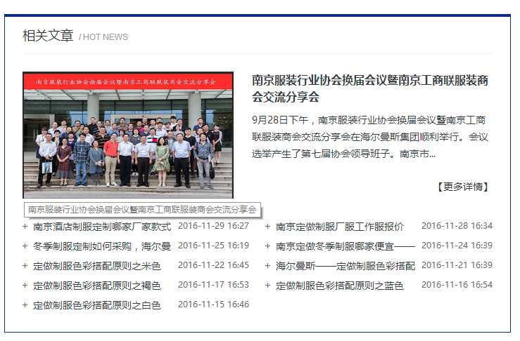

#相关文章标签使用说明

##使用样例
    <ul>
        <nsw:relarticle type="p1-相关产品" size="10" aid="${infoId}"   var="A">
            <li> ${A.title}</li>
        </nsw:relarticle>
    </ul>

##生成效果
    <ul>
        <li> 如何提升服装店铺业绩</li>
        <li> 文章junit</li>
        <li> 洗水设备-女人百合</li>
    </ul>

##变量说明
|变量名|是否必须 |默认值| 说明|
----------|---------|--------|----------|
var       |否    |  A |循环变量名
stat    |否  |stat   |循环索引变量
aid|否| | 文章id,如果指定，则获取指定文章的相关文章
pid|否| | 产品id,如果指定，则获取指定产品的相关文章
type|是| |我们定义的版块类型名称，如_推荐文章_ _相关产品_ _成功案例_
size|否|10|总条数，如果关联条数超过这个设定的值，则会最多取这个值相等量的文章数
start|否|1|循环的起始行数，默认从1开始
end|否| | 循环结束，比如可能取了100条数据，只需要到80就可以了，那么这里写80
step|否|1|循环的递增量，默认为1，如果要取1,3,5,7这样跳着取，则取2

###循环变量 stat的使用
stat变量包含：

| 变量名称|说明|
|------------|------|
index        |当前循环数，从0开始
count        | 当前循环数 从1开始
size          |总大小
odd          | 是否是偶数行
even        |  是否是奇数行   
first           | 是否是第一行
last           |  是不是最后一行

##我可以使用文章的哪些信息
    {
        "displayTime": "",
        "isRecommend": true,
        "imgSm": {
            "url": "26337_PC/20150625174929_33182.jpg",
            "alt": "先进的洗水设备-女人百合"
        },
        "ctgName": "一级分类",
        "shortTitle": "",
        "title": "洗水设备-女人百合",
        "isDisplayTop": false,
        "linkUrl": "",
        "createdTime": "2015-11-27 17:56:02",
        "authorLink": "",
        "owner": "USR1001",
        "publishTime": "2015-11-27 00:00:00",
        "editor": "",
        "isLink": false,
        "src": "",
        "author": "",
        "lastUpdTime": "2016-12-23 15:29:27",
        "url": "articles/XiShuiSheBei.html",
        "editorLink": "",
        "srcLink": "",
        "site": "26337",
        "clicks": "3",
        "channelName": "资讯频道",
        "desc": ""
    }
_任何时候，通过文章的 url 总是能获取正确的url地址_

##可以用在哪些地方?
详情页，其他页
##一个案例
满海激光详情页

思路和样式都比较简单

    
 
     <ul>
      <nsw:relarticle type="p1-相关文章">
      <li>${A.publishTime} <a href="${A.url}" title="${A.url}">${A.title}</a></li> 
      </nsw:relarticle> 
     </ul> 
    

另一个案例

大概思路
+ 总共10条
+ 第一条有图片
+ 剩下9个列表 
大致写法如下

    
 
        <h3>相关文章 / Hot News </h3> 
        
 
            <dl> 
                <nsw:relarticle type="p1-相关文章" size="10" end="2">
                <dt> 
                     
                </dt> 
                <dd> 
                    <a href="${A.url}" title="${A.title}"> ${A.title} </a> 
                     
${A.desc}...
 
                    <em><a href="${A.url}" title="${A.title}">【更多详情】</a></em> 
                </dd>
                </nsw:relarticle> 
            </dl> 
            <ul>
            <nsw:relarticle type="p1-相关文章" size="10" start="2">
                <li>${A.publishTime} <a href="${A.url}" title="${A.title}">${A.title}</a></li> 
            </nsw:relarticle>
            </ul> 
        
 
    

