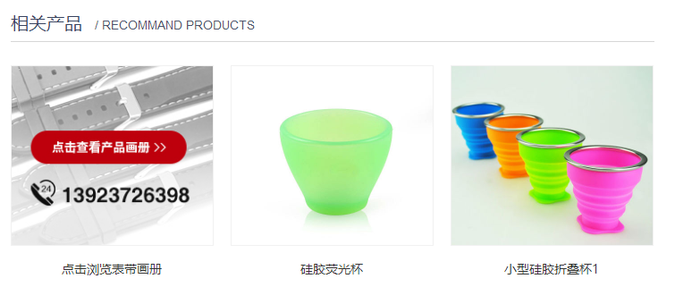
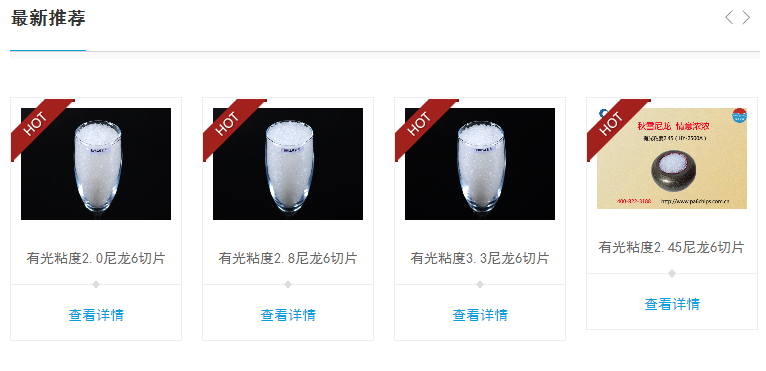

#相关产品标签使用说明
使用方式同相关文章一样，使用方式和参数均不变

##使用样例
    <ul>
        <nsw:relproduct type="t2-模版头部-11" size="10" pid="${pId}" var="P">
            <li> ${P.title}</li>
        </nsw:relproduct>
    </ul>

##生成效果
    <ul>
        <li> 有光粘度2.8尼龙6切片</li>
        <li> 有光粘度3.3尼龙6切片</li>
        <li> 有光粘度2.45尼龙6切片</li>
        <li> DDDD</li>
    </ul>

##变量说明
|变量名|是否必须 |默认值| 说明|
----------|---------|--------|----------|
var       |否    | P  |循环变量名
stat    |否  |stat   |循环索引变量
aid|否| | 文章id,如果指定，则获取指定文章的相关文章
pid|否| | 产品id,如果指定，则获取指定产品的相关文章
type|是| |我们定义的版块类型名称，如_推荐文章_ _相关产品_ _成功案例_
size|否|10|总条数，如果关联条数超过这个设定的值，则会最多取这个值相等量的文章数
start|否|1|循环的起始行数，默认从1开始
end|否| | 循环结束，比如可能取了100条数据，只需要到80就可以了，那么这里写80
step|否|1|循环的递增量，默认为1，如果要取1,3,5,7这样跳着取，则取2

###循环变量 stat的使用
stat变量包含：

| 变量名称|说明|
|------------|------|
index        |当前循环数，从0开始
count        | 当前循环数 从1开始
size          |总大小
odd          | 是否是偶数行
even        |  是否是奇数行   
first           | 是否是第一行
last           |  是不是最后一行

##我可以使用产品的哪些信息
    {
    "_id": "577cc7d682ced8588dc7a40a",
    "clicks": 1,
    "seo": {
        "staticPageName": "YouGuangNianDu28QiePian",
        "title": "有光粘度2.8尼龙6切片",
        "keyword": "尼龙6切片,江苏海阳秋雪",
        "desc": "秋雪牌有光切片,透明度高,耐磨性好,关键工艺,重要设备全部实行电脑自动检测和监控,服务热线：400-822-3188"
    },
    "publishTime": "2016-07-06 16:55",
    "title": "有光粘度2.8尼龙6切片",
    "moduleId": "577b5e5682ced22a41c4d773",
    "projId": "27521_PC",
    "shortTitle": "",
    "isLink": false,
    "linkUrl": "",
    "isEnableThirdPartyMall": false,
    "thirdPartyMallUrl": "",
    "index": 4,
    "startLevel": "",
    "isRecommend": true,
    "isDisplayTop": false,
    "isDisplayInMainPage": false,
    "isDisplay": true,
    "displayTime": "",
    "tags": null,
    "lastUpdTime": "2016-12-20 23:48:05",
    "createdTime": "2016-07-06 16:56:54",
    "sort": 13,
    "site": "27605",
    "url": "products/YouGuangNianDu28QiePian.html",
    "imgs": [
        {
            "url": "27605_PC/resource/images/22.0.jpg",
            "urlSm": "27605_PC/resource/images/22.0_sm.jpg",
            "alt": "有光粘度2.8尼龙6切片"
        }
    ],
    "imgSm": [
        {
            "url": "27605_PC/resource/images/22.0.jpg",
            "urlSm": "27605_PC/resource/images/22.0_sm.jpg",
            "alt": "有光粘度2.8尼龙6切片"
        }
    ],
    "desc": "
\n\t江苏海阳化纤有限公司“秋雪”牌有光粘度2.8尼龙6切片...\n
",
    "channelName": "产品频道",
    "ctgName": "测试1"
}
_任何时候，通过文章的 url 总是能获取正确的url地址_

##可以用在哪些地方?
详情页，其他页

##一个案例
满海激光详情页

比较简单，大致写法如下

    <ul class="rightpro-body">
        <nsw:relproduct type="t2-模版头部-11" size="10" var="P">
        <li class="nth3"><a target="_blank" href="${P.url}" title="${P.title}">
${P.title}<em></em>
</a> </li>
        </nsw:relproduct>
    </ul>

另一个案例

全部为列表，写法比较简单
大致写法如下

    
 
        
 
            <h3>最新推荐</h3> 
        
 
        
 
            

 
            

 
        
 
        
 
            

                <ul style="width: 1728px; position: relative; overflow: hidden; padding: 0px; margin: 0px; left: -384px;">
                    <nsw:relproduct type="p1-相关产品-1">
                        <li class="clone" style="float: left; width: 192px;"> <a href="${P.url}" title="${P.titl}">${P.title}<em>查看详情</em> <i></i> </a> </li>
                    </nsw:relproduct>
                </ul>
            
 
        
 
    

