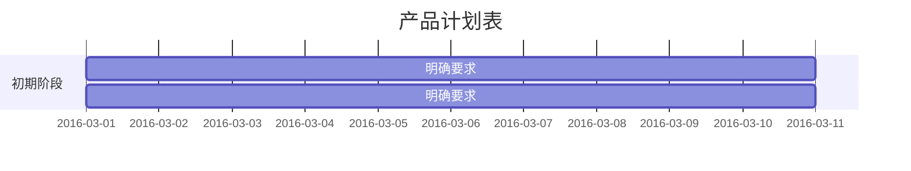

# css学习
 


## 二级标题
### 三级标题
#### 四级标题

***




```javascript {cmd="node"}
const date = Date.now()
console.log(date.toString())
``` 
```html {cmd="html"}
    <div>
        <span>
        </span>
    </div>
``` 

###无序列表
- 列表1
    - 项目一
    - 项目二
        - 项目三
            - 项目四


- [ ] dfsdfds
    - [x] 1111

| Tables        | Are           | Cool  |
| ------------- |:-------------:| -----:|
| col 3 is      | right-aligned | $1600 |
| col 2 is      | centered      |   $12 |
| zebra stripes | are neat      |    $1 |
